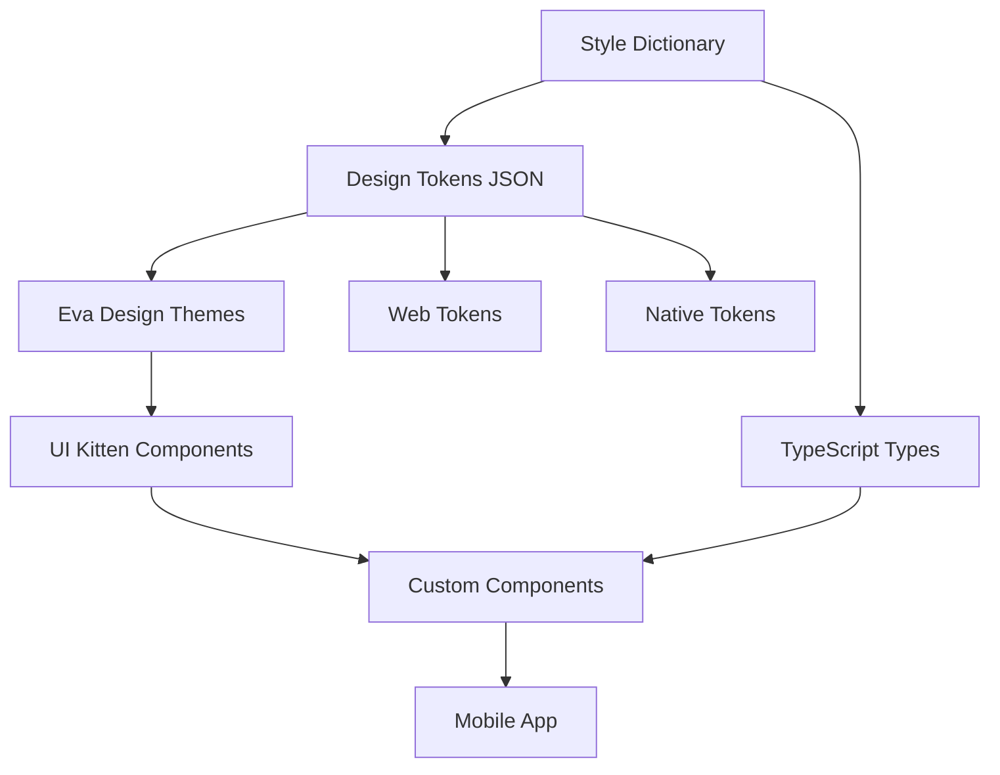

# Design Document

## Overview

This design outlines the comprehensive revision of the mobile UI design system to leverage Eva Design from UI Kitten as the foundational design system, integrated with Style Dictionary for robust design token management. The solution maintains backward compatibility while providing enhanced theming, accessibility, and visual consistency across all mobile applications in the monorepo.

## Architecture

### High-Level Architecture



### Design System Layers

1. **Token Layer**: Style Dictionary manages design tokens in JSON format
2. **Eva Design Layer**: Transforms tokens into Eva Design-compatible themes
3. **UI Kitten Layer**: Provides base components following Eva Design principles
4. **Custom Component Layer**: Extends UI Kitten components with project-specific functionality
5. **Application Layer**: Consumes components with Eva Design theming

## Components and Interfaces

### Style Dictionary Configuration

```typescript
// style-dictionary.config.js
interface StyleDictionaryConfig {
  source: string[];
  platforms: {
    'eva-design': {
      transformGroup: 'eva-design';
      buildPath: string;
      files: Array<{
        destination: string;
        format: string;
        filter?: (token: Token) => boolean;
      }>;
    };
    'react-native': {
      transformGroup: 'react-native';
      buildPath: string;
      files: Array<{
        destination: string;
        format: string;
      }>;
    };
  };
}
```

### Eva Design Theme Structure

```typescript
// Eva Design theme interface
interface EvaTheme {
  'color-primary-100': string;
  'color-primary-200': string;
  'color-primary-300': string;
  'color-primary-400': string;
  'color-primary-500': string;
  'color-primary-600': string;
  'color-primary-700': string;
  'color-primary-800': string;
  'color-primary-900': string;
  'color-primary-transparent-100': string;
  'color-primary-transparent-200': string;
  'color-primary-transparent-300': string;
  'color-primary-transparent-400': string;
  'color-primary-transparent-500': string;
  'color-primary-transparent-600': string;

  // Success, Info, Warning, Danger color scales
  // Text colors
  // Background colors
  // Border colors
  // Size tokens
  // Typography tokens
}
```

### Component Architecture

```typescript
// Base component interface extending UI Kitten
interface BaseComponentProps {
  eva?: EvaProp;
  style?: StyleProp<ViewStyle>;
  children?: React.ReactNode;
}

// Enhanced component with Eva Design integration
interface EnhancedComponent<T = {}> extends BaseComponentProps {
  // Maintain existing API
  variant?: string;
  size?: string;
  status?: string;
  // Eva Design specific props
  appearance?: string;
  accessoryLeft?: RenderProp<Partial<ImageProps>>;
  accessoryRight?: RenderProp<Partial<ImageProps>>;
}
```

### Theme Provider Architecture

```typescript
// Enhanced theme provider
interface ThemeProviderProps {
  theme?: 'light' | 'dark' | EvaTheme;
  children: React.ReactNode;
  customMapping?: SchemaType;
}

// Theme context with Eva Design integration
interface ThemeContextValue {
  theme: EvaTheme;
  themeMode: 'light' | 'dark';
  toggleTheme: () => void;
  updateTheme: (theme: Partial<EvaTheme>) => void;
}
```

## Data Models

### Design Token Structure

```json
{
  "color": {
    "primary": {
      "50": { "value": "#f0f9ff" },
      "100": { "value": "#e0f2fe" },
      "200": { "value": "#bae6fd" },
      "300": { "value": "#7dd3fc" },
      "400": { "value": "#38bdf8" },
      "500": { "value": "#0ea5e9" },
      "600": { "value": "#0284c7" },
      "700": { "value": "#0369a1" },
      "800": { "value": "#075985" },
      "900": { "value": "#0c4a6e" }
    },
    "semantic": {
      "success": { "value": "{color.green.500}" },
      "warning": { "value": "{color.yellow.500}" },
      "error": { "value": "{color.red.500}" },
      "info": { "value": "{color.blue.500}" }
    }
  },
  "spacing": {
    "xs": { "value": "4px" },
    "sm": { "value": "8px" },
    "md": { "value": "16px" },
    "lg": { "value": "24px" },
    "xl": { "value": "32px" }
  },
  "typography": {
    "fontFamily": {
      "primary": { "value": "System" }
    },
    "fontSize": {
      "xs": { "value": "12px" },
      "sm": { "value": "14px" },
      "md": { "value": "16px" },
      "lg": { "value": "18px" },
      "xl": { "value": "20px" }
    },
    "fontWeight": {
      "normal": { "value": "400" },
      "medium": { "value": "500" },
      "semibold": { "value": "600" },
      "bold": { "value": "700" }
    }
  }
}
```

### Eva Design Mapping

```typescript
// Custom Eva Design mapping
const customMapping: SchemaType = {
  strict: {
    'text-font-family': 'typography.fontFamily.primary',
    'text-font-size': 'typography.fontSize.md',
    'text-font-weight': 'typography.fontWeight.normal',
    'color-primary-default': 'color.primary.500',
    'color-primary-hover': 'color.primary.600',
    'color-primary-active': 'color.primary.700',
    'color-success-default': 'color.semantic.success',
    'color-warning-default': 'color.semantic.warning',
    'color-danger-default': 'color.semantic.error',
    'color-info-default': 'color.semantic.info',
  },
};
```

## Error Handling

### Token Validation

```typescript
// Token validation system
interface TokenValidator {
  validateColorTokens(tokens: ColorTokens): ValidationResult;
  validateSpacingTokens(tokens: SpacingTokens): ValidationResult;
  validateTypographyTokens(tokens: TypographyTokens): ValidationResult;
  validateEvaCompatibility(theme: EvaTheme): ValidationResult;
}

// Error types
class TokenValidationError extends Error {
  constructor(
    public tokenPath: string,
    public validationRule: string,
    message: string,
  ) {
    super(message);
  }
}

class EvaThemeError extends Error {
  constructor(
    public themeProperty: string,
    message: string,
  ) {
    super(message);
  }
}
```

### Build-time Validation

```typescript
// Build-time validation hooks
interface BuildValidation {
  preTransform: (tokens: DesignTokens) => ValidationResult;
  postTransform: (evaTheme: EvaTheme) => ValidationResult;
  preGeneration: (config: StyleDictionaryConfig) => ValidationResult;
  postGeneration: (files: GeneratedFile[]) => ValidationResult;
}
```

### Runtime Error Handling

```typescript
// Component error boundaries
interface ComponentErrorBoundary {
  fallbackComponent: React.ComponentType<{ error: Error }>;
  onError: (error: Error, errorInfo: ErrorInfo) => void;
  resetOnPropsChange?: boolean;
}

// Theme fallback system
interface ThemeFallback {
  fallbackTheme: EvaTheme;
  onThemeError: (error: EvaThemeError) => void;
  validateThemeOnChange: boolean;
}
```

## Testing Strategy

### Unit Testing Approach

1. **Token Generation Testing**
   - Validate Style Dictionary configuration
   - Test token transformation accuracy
   - Verify Eva Design theme generation
   - Test TypeScript type generation

2. **Component Testing**
   - Test Eva Design component integration
   - Validate prop forwarding to UI Kitten components
   - Test theme application and switching
   - Verify accessibility features

3. **Theme Testing**
   - Test theme provider functionality
   - Validate theme switching behavior
   - Test custom theme application
   - Verify theme persistence

### Integration Testing

1. **Build System Integration**
   - Test Style Dictionary build process
   - Validate generated file outputs
   - Test build failure scenarios
   - Verify clean build processes

2. **Component Library Integration**
   - Test component composition
   - Validate theme propagation
   - Test component interaction patterns
   - Verify performance characteristics

### Visual Regression Testing

1. **Storybook Integration**
   - Update stories for Eva Design components
   - Test theme switching in Storybook
   - Validate component variants
   - Test responsive behavior

2. **Chromatic Testing**
   - Visual regression tests for all components
   - Theme switching visual tests
   - Accessibility visual tests
   - Cross-platform visual consistency

### Performance Testing

1. **Bundle Size Analysis**
   - Monitor Eva Design bundle impact
   - Test tree-shaking effectiveness
   - Validate Style Dictionary output size
   - Test component lazy loading

2. **Runtime Performance**
   - Theme switching performance
   - Component render performance
   - Memory usage analysis
   - Animation performance testing

## Implementation Phases

### Phase 1: Foundation Setup

- Install and configure Eva Design and UI Kitten dependencies
- Set up Style Dictionary configuration and build process
- Create base token structure and Eva Design theme generation
- Implement enhanced theme provider with Eva Design integration

### Phase 2: Component Migration

- Migrate core components (Button, Text, Input) to Eva Design base
- Implement component composition patterns with UI Kitten
- Update component APIs to maintain backward compatibility
- Add Eva Design-specific features and props

### Phase 3: Advanced Components

- Migrate complex components (Card, Modal, TabBar) to Eva Design
- Implement custom Eva Design mappings for project-specific needs
- Add enhanced theming and customization capabilities
- Integrate Eva Design icons and assets

### Phase 4: Mobile App Integration

- Update mobile app to use Eva Design ApplicationProvider
- Migrate app-specific components to new design system
- Implement theme persistence and switching
- Update navigation and routing integration

### Phase 5: Testing and Documentation

- Update all test suites for Eva Design integration
- Create comprehensive documentation and migration guides
- Update Storybook stories and visual tests
- Perform performance optimization and bundle analysis

## Migration Strategy

### Backward Compatibility Approach

1. **API Preservation**
   - Maintain existing component prop interfaces
   - Provide deprecated prop warnings with migration paths
   - Support gradual migration through feature flags
   - Maintain existing theme structure alongside Eva Design themes

2. **Gradual Migration Path**
   - Component-by-component migration support
   - Side-by-side old and new component usage
   - Migration utilities and helper functions
   - Comprehensive migration documentation

### Breaking Changes Management

1. **Identified Breaking Changes**
   - Theme structure changes (mitigated by compatibility layer)
   - Some component styling differences (documented with migration guide)
   - Icon system changes (migration utilities provided)
   - Build process changes (automated migration scripts)

2. **Migration Tools**
   - Automated codemod scripts for common patterns
   - Theme migration utilities
   - Component prop migration helpers
   - Validation tools for migration completeness
