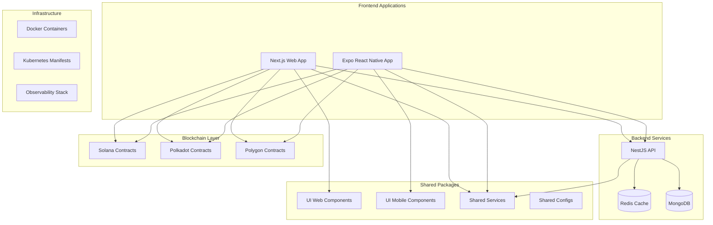

# Design Document

## Overview

This design outlines the comprehensive modernization of a todo application monorepo, transforming it into a fully functional ecosystem with blockchain integration, modern frameworks, and robust testing. The system will consist of multiple applications (web, mobile, API, contracts) with shared packages, comprehensive infrastructure, and wallet connectivity for decentralized todo storage.

## Architecture

### High-Level Architecture



### Technology Stack

- **Monorepo Management**: Turborepo + pnpm
- **Web Frontend**: Next.js 14 with TypeScript
- **Mobile Frontend**: Expo React Native with TypeScript
- **API Backend**: NestJS with TypeScript
- **Database**: MongoDB with Redis caching
- **Blockchain**: Solana, Polkadot (Substrate), Polygon contracts
- **Wallet Integration**: WalletConnect v2
- **UI Libraries**: React + Vite (web), Expo React Native + Vite packaging (mobile)
- **Testing**: Jest, Playwright, React/React Native Testing Library
- **Infrastructure**: Docker, Kubernetes, OpenTelemetry

## Components and Interfaces

### 1. Web Application (Next.js)

**Purpose**: Modern web interface for todo management with wallet connectivity

**Key Components**:
- Todo List Management UI
- Wallet Connection Interface
- Blockchain Network Selection
- User Authentication
- Responsive Design

**Technology Decisions**:
- Next.js 14 for SSR/SSG capabilities and modern React features
- App Router for improved routing and layouts
- Tailwind CSS for styling consistency
- WalletConnect for multi-wallet support

### 2. Mobile Application (Expo React Native)

**Purpose**: Cross-platform mobile app with native performance

**Key Components**:
- Native Todo Management Interface
- Mobile Wallet Integration
- Offline Capability
- Push Notifications
- Platform-specific optimizations

**Technology Decisions**:
- Expo SDK 49+ for rapid development and deployment
- React Native 0.72+ for latest features
- Expo Router for navigation
- WalletConnect React Native for wallet integration

### 3. API Backend (NestJS)

**Purpose**: Robust, scalable API with caching and observability

**Key Components**:
- RESTful API endpoints
- Authentication middleware
- Database integration
- Redis caching layer
- OpenTelemetry instrumentation

**Technology Decisions**:
- NestJS for enterprise-grade architecture
- MongoDB with Mongoose for data persistence
- Redis for caching and session management
- JWT for authentication
- Swagger for API documentation

### 4. Blockchain Contracts

**Purpose**: Decentralized todo storage across multiple networks

**Components**:
- **Solana Program**: Rust-based program for Solana network
- **Polkadot Pallet**: Substrate-based pallet for Polkadot ecosystem
- **Polygon Contract**: Solidity smart contract for Polygon network

**Technology Decisions**:
- Solana: Anchor framework for program development
- Polkadot: Substrate framework with ink! smart contracts
- Polygon: Hardhat for Solidity development and deployment

### 5. Shared UI Packages

**Web UI Package (`packages/ui-web`)**:
- React components built with Vite
- Storybook for component documentation
- Tailwind CSS for styling
- TypeScript for type safety

**Mobile UI Package (`packages/ui-mobile`)**:
- React Native components
- Vite for library packaging
- Consistent theming with web
- Platform-specific adaptations

### 6. Infrastructure Components

**Docker Configuration**:
- Multi-stage builds for optimization
- Development and production environments
- Service orchestration with docker-compose

**Kubernetes Manifests**:
- Deployment configurations
- Service definitions
- Ingress controllers
- ConfigMaps and Secrets

**Observability Stack**:
- OpenTelemetry for distributed tracing
- Prometheus for metrics collection
- Grafana for visualization
- Elasticsearch for log aggregation

## Data Models

### Core Todo Model

```typescript
interface Todo {
  id: string;
  title: string;
  description?: string;
  completed: boolean;
  priority: 'low' | 'medium' | 'high';
  dueDate?: Date;
  tags: string[];
  createdAt: Date;
  updatedAt: Date;
  userId: string;
  // Blockchain-specific fields
  blockchainNetwork?: 'solana' | 'polkadot' | 'polygon';
  transactionHash?: string;
  blockchainAddress?: string;
}
```

### User Model

```typescript
interface User {
  id: string;
  email?: string;
  walletAddress?: string;
  preferredNetwork?: 'solana' | 'polkadot' | 'polygon';
  settings: UserSettings;
  createdAt: Date;
  updatedAt: Date;
}

interface UserSettings {
  theme: 'light' | 'dark';
  notifications: boolean;
  defaultPriority: 'low' | 'medium' | 'high';
}
```

### Blockchain Transaction Model

```typescript
interface BlockchainTransaction {
  id: string;
  todoId: string;
  userId: string;
  network: 'solana' | 'polkadot' | 'polygon';
  transactionHash: string;
  blockNumber?: number;
  status: 'pending' | 'confirmed' | 'failed';
  gasUsed?: number;
  createdAt: Date;
  confirmedAt?: Date;
}
```

## Error Handling

### API Error Handling Strategy

1. **Global Exception Filter**: Centralized error handling in NestJS
2. **Custom Exception Types**: Domain-specific error classes
3. **Error Response Format**: Consistent error response structure
4. **Logging Integration**: Structured error logging with context

### Frontend Error Handling

1. **Error Boundaries**: React error boundaries for component-level errors
2. **Global Error Handler**: Application-wide error handling
3. **User-Friendly Messages**: Translated error messages for users
4. **Retry Mechanisms**: Automatic retry for transient failures

### Blockchain Error Handling

1. **Transaction Monitoring**: Real-time transaction status tracking
2. **Network-Specific Errors**: Handling different blockchain error types
3. **Fallback Mechanisms**: Graceful degradation when blockchain is unavailable
4. **Gas Estimation**: Proper gas estimation and error handling

## Testing Strategy

### Unit Testing

**Coverage Requirements**: Minimum 80% code coverage across all applications

**Testing Libraries**:
- **API**: Jest with Supertest for HTTP testing
- **Web**: Jest with React Testing Library
- **Mobile**: Jest with React Native Testing Library
- **Contracts**: Network-specific testing frameworks

**Test Categories**:
- Component testing for UI components
- Service testing for business logic
- Repository testing for data access
- Utility function testing

### Integration Testing

**API Integration Tests**:
- Database integration testing with test containers
- Redis integration testing
- External service integration testing

**Frontend Integration Tests**:
- API integration testing with mock servers
- Wallet integration testing with mock wallets
- Cross-component integration testing

### End-to-End Testing

**Web E2E Testing**:
- Playwright for comprehensive browser testing
- User journey testing
- Cross-browser compatibility testing
- Accessibility testing

**Mobile E2E Testing**:
- Detox for React Native E2E testing
- Device-specific testing
- Platform-specific feature testing

**API E2E Testing**:
- Full request-response cycle testing
- Authentication flow testing
- Error scenario testing

### Contract Testing

**Blockchain Testing**:
- Solana: Anchor testing framework
- Polkadot: Substrate testing utilities
- Polygon: Hardhat testing with Waffle

**Test Scenarios**:
- Contract deployment testing
- Function execution testing
- Gas optimization testing
- Security vulnerability testing

## Security Considerations

### Authentication & Authorization

1. **JWT Token Management**: Secure token generation and validation
2. **Wallet-Based Authentication**: Signature-based authentication
3. **Role-Based Access Control**: User permission management
4. **Rate Limiting**: API endpoint protection

### Data Security

1. **Input Validation**: Comprehensive input sanitization
2. **SQL Injection Prevention**: Parameterized queries
3. **XSS Protection**: Content Security Policy implementation
4. **CORS Configuration**: Proper cross-origin resource sharing

### Blockchain Security

1. **Smart Contract Auditing**: Security review of all contracts
2. **Private Key Management**: Secure key storage and handling
3. **Transaction Validation**: Proper transaction verification
4. **Network Security**: Protection against common blockchain attacks

## Performance Optimization

### Caching Strategy

1. **Redis Caching**: Frequently accessed data caching
2. **Browser Caching**: Static asset caching
3. **CDN Integration**: Content delivery optimization
4. **Database Query Optimization**: Efficient query patterns

### Bundle Optimization

1. **Code Splitting**: Dynamic imports for reduced bundle size
2. **Tree Shaking**: Unused code elimination
3. **Asset Optimization**: Image and resource optimization
4. **Lazy Loading**: Component and route lazy loading

### Database Optimization

1. **Indexing Strategy**: Proper database indexing
2. **Query Optimization**: Efficient database queries
3. **Connection Pooling**: Database connection management
4. **Data Pagination**: Large dataset handling

## Deployment Strategy

### Development Environment

1. **Docker Compose**: Local development orchestration
2. **Hot Reloading**: Development-time code reloading
3. **Environment Variables**: Configuration management
4. **Service Discovery**: Inter-service communication

### Production Environment

1. **Kubernetes Deployment**: Container orchestration
2. **Load Balancing**: Traffic distribution
3. **Auto Scaling**: Dynamic resource allocation
4. **Health Checks**: Service monitoring and recovery

### CI/CD Pipeline

1. **Automated Testing**: Comprehensive test execution
2. **Build Optimization**: Efficient build processes
3. **Deployment Automation**: Automated deployment workflows
4. **Rollback Mechanisms**: Safe deployment rollback

## Monitoring and Observability

### Metrics Collection

1. **Application Metrics**: Performance and usage metrics
2. **Infrastructure Metrics**: System resource monitoring
3. **Business Metrics**: User engagement and feature usage
4. **Custom Metrics**: Domain-specific measurements

### Distributed Tracing

1. **OpenTelemetry Integration**: Comprehensive tracing
2. **Request Correlation**: End-to-end request tracking
3. **Performance Profiling**: Bottleneck identification
4. **Error Tracking**: Error propagation analysis

### Logging Strategy

1. **Structured Logging**: Consistent log format
2. **Log Aggregation**: Centralized log collection
3. **Log Analysis**: Automated log analysis and alerting
4. **Retention Policies**: Log storage management