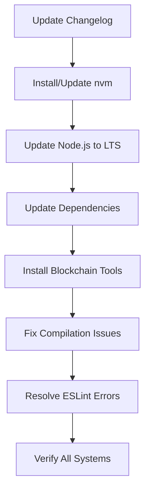

# Design Document

## Overview

The project modernization involves a systematic approach to updating the entire monorepo infrastructure, dependencies, and toolchain. This design ensures minimal disruption while maximizing the benefits of modern tooling and resolving all compilation and linting issues.

## Architecture

### Modernization Strategy

The modernization follows a layered approach:

1. **Foundation Layer**: Node.js runtime and package manager updates
2. **Dependency Layer**: Package updates with compatibility verification
3. **Toolchain Layer**: Blockchain development tools installation and configuration
4. **Quality Layer**: ESLint error resolution and code quality improvements
5. **Documentation Layer**: Changelog updates and documentation maintenance

### Update Sequence



## Components and Interfaces

### Node.js Runtime Management

- **nvm Installation**: Ensure Node Version Manager is available for version switching
- **LTS Detection**: Automatically detect and install the latest Node.js LTS version
- **.nvmrc Update**: Update the version specification file
- **Compatibility Verification**: Ensure all applications work with the new Node.js version

### Dependency Management System

- **Package Analysis**: Scan all package.json files for outdated dependencies
- **Compatibility Matrix**: Maintain compatibility across monorepo packages
- **Update Strategy**: Prioritize security updates and major version upgrades
- **Lock File Management**: Regenerate pnpm-lock.yaml with new versions

### Blockchain Toolchain Setup

#### Solana Development Environment

- **Rust Toolchain**: Install/update Rust with correct version for Solana
- **Solana CLI**: Install latest Solana command-line tools
- **Anchor Framework**: Install Anchor CLI and dependencies
- **Program Compilation**: Verify Rust program compilation works

#### Multi-Network Support

- **Hardhat**: Ensure Polygon/Ethereum toolchain works
- **Substrate**: Verify Polkadot development tools
- **Cross-Platform**: Ensure all blockchain tools work together

### Code Quality System

#### ESLint Configuration

- **Rule Updates**: Update ESLint rules for latest versions
- **Framework Compatibility**: Ensure rules work with Next.js, NestJS, React Native
- **TypeScript Integration**: Resolve TypeScript-ESLint conflicts
- **Unused Code Detection**: Systematic removal of unused imports/variables

#### Error Resolution Strategy

- **Automated Fixes**: Use ESLint auto-fix where possible
- **Manual Resolution**: Address complex linting issues manually
- **Selective Disabling**: Use eslint-disable only when absolutely necessary
- **Documentation**: Comment all disabled rules with justification

## Data Models

### Dependency Update Record

```typescript
interface DependencyUpdate {
  package: string;
  oldVersion: string;
  newVersion: string;
  updateType: 'major' | 'minor' | 'patch';
  breakingChanges: boolean;
  securityFix: boolean;
}
```

### Tool Installation Status

```typescript
interface ToolStatus {
  name: string;
  installed: boolean;
  version: string;
  requiredVersion: string;
  configurationValid: boolean;
}
```

### Compilation Result

```typescript
interface CompilationResult {
  target: string; // 'solana' | 'polygon' | 'polkadot' | 'web' | 'api' | 'mobile'
  success: boolean;
  errors: string[];
  warnings: string[];
  artifacts: string[];
}
```

## Error Handling

### Dependency Update Failures

- **Rollback Strategy**: Maintain backup of working package.json files
- **Incremental Updates**: Update packages in small batches to isolate issues
- **Compatibility Testing**: Test each major update before proceeding
- **Alternative Packages**: Identify replacement packages for deprecated ones

### Compilation Failures

- **Tool Verification**: Verify all required tools are properly installed
- **Environment Setup**: Ensure environment variables and paths are correct
- **Dependency Resolution**: Resolve missing or conflicting dependencies
- **Version Compatibility**: Ensure tool versions are compatible

### ESLint Resolution Failures

- **Rule Analysis**: Identify which rules are causing failures
- **Configuration Updates**: Update ESLint configurations for new versions
- **Code Refactoring**: Refactor code to meet updated standards
- **Selective Disabling**: Disable rules only when code patterns are intentionally required

## Testing Strategy

### Verification Steps

1. **Build Verification**
   - All applications compile successfully
   - All packages build without errors
   - All smart contracts compile across networks

2. **Runtime Verification**
   - Development servers start successfully
   - All tests pass with new dependencies
   - Integration tests work with updated components

3. **Quality Verification**
   - ESLint passes across all code
   - TypeScript compilation succeeds
   - No security vulnerabilities in dependencies

### Rollback Plan

- Maintain git branches for each major update step
- Keep backup copies of critical configuration files
- Document all changes for easy reversal if needed
- Test rollback procedures before major updates

## Implementation Phases

### Phase 1: Foundation Setup

- Update changelog with planned changes
- Install/update nvm
- Update Node.js to latest LTS
- Verify basic functionality

### Phase 2: Dependency Modernization

- Analyze current dependencies
- Update packages incrementally
- Regenerate lock files
- Test compatibility

### Phase 3: Blockchain Toolchain

- Install Rust toolchain
- Install Solana CLI and Anchor
- Verify Hardhat and Substrate tools
- Test contract compilation

### Phase 4: Quality Assurance

- Run comprehensive ESLint checks
- Fix all linting errors
- Update linting configurations
- Verify code quality standards

### Phase 5: Final Verification

- Run full build process
- Execute all tests
- Verify all applications work
- Update documentation
