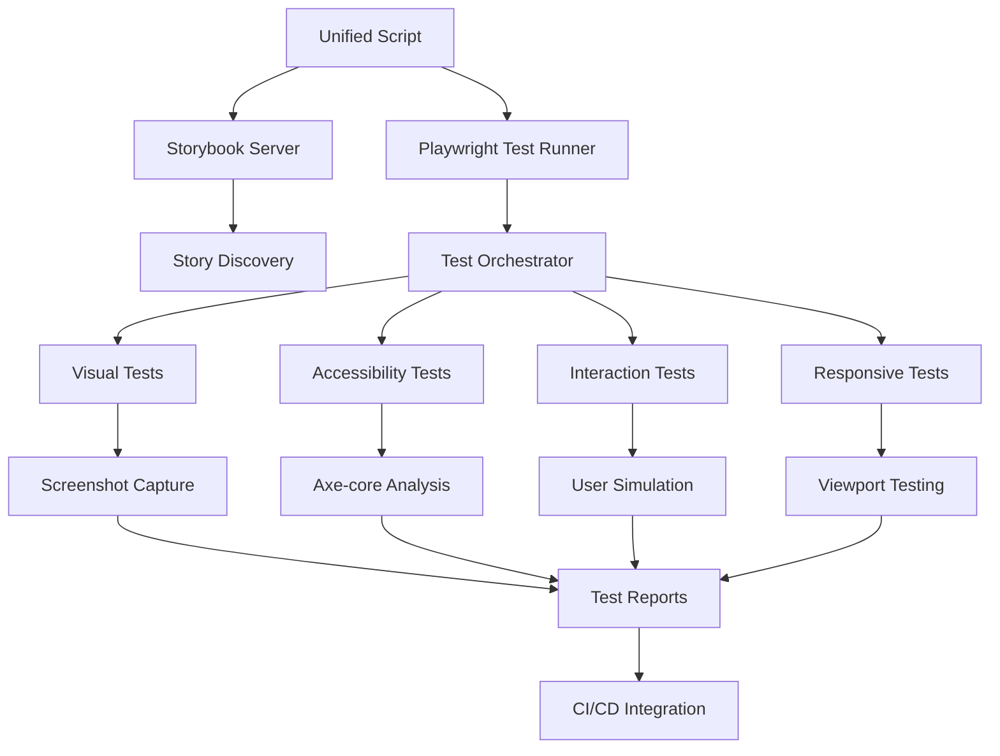

# Design Document

## Overview

The ui-mobile Storybook Playwright automation system will provide comprehensive testing for all React Native components in Storybook. The system will automatically discover stories, perform visual regression testing, accessibility validation, and interaction testing across multiple device configurations and themes.

## Architecture

### High-Level Architecture



### Component Architecture

The system consists of several key components:

1. **Test Discovery Engine**: Automatically finds and catalogs all Storybook stories
2. **Test Orchestrator**: Manages test execution across different configurations
3. **Visual Testing Module**: Handles screenshot capture and comparison
4. **Accessibility Testing Module**: Performs a11y validation using axe-core
5. **Interaction Testing Module**: Simulates user interactions and validates responses
6. **Reporting System**: Generates comprehensive test reports and artifacts

## Components and Interfaces

### 1. Story Discovery Service

```typescript
interface StoryDiscoveryService {
  discoverStories(): Promise<StoryMetadata[]>;
  getStoryUrl(storyId: string): string;
  validateStoryExists(storyId: string): Promise<boolean>;
}

interface StoryMetadata {
  id: string;
  title: string;
  name: string;
  component: string;
  parameters: StoryParameters;
  args: Record<string, any>;
}

interface StoryParameters {
  viewport?: ViewportConfig;
  theme?: ThemeConfig;
  accessibility?: AccessibilityConfig;
  interactions?: InteractionConfig;
}
```

### 2. Test Configuration Manager

```typescript
interface TestConfigurationManager {
  getTestConfig(): TestConfiguration;
  getViewportConfigs(): ViewportConfig[];
  getThemeConfigs(): ThemeConfig[];
  getBrowserConfigs(): BrowserConfig[];
}

interface TestConfiguration {
  baseUrl: string;
  timeout: number;
  retries: number;
  parallel: boolean;
  headless: boolean;
  outputDir: string;
  reportDir: string;
}

interface ViewportConfig {
  name: string;
  width: number;
  height: number;
  deviceScaleFactor: number;
  isMobile: boolean;
}

interface ThemeConfig {
  name: string;
  mode: 'light' | 'dark';
  parameters: Record<string, any>;
}
```

### 3. Visual Testing Engine

```typescript
interface VisualTestingEngine {
  captureStoryScreenshot(story: StoryMetadata, config: TestConfig): Promise<ScreenshotResult>;
  compareScreenshots(baseline: string, current: string): Promise<ComparisonResult>;
  generateVisualReport(results: ScreenshotResult[]): Promise<VisualReport>;
}

interface ScreenshotResult {
  storyId: string;
  viewport: ViewportConfig;
  theme: ThemeConfig;
  screenshotPath: string;
  timestamp: Date;
  success: boolean;
  error?: string;
}

interface ComparisonResult {
  match: boolean;
  difference: number;
  diffImagePath?: string;
  threshold: number;
}
```

### 4. Accessibility Testing Engine

```typescript
interface AccessibilityTestingEngine {
  runAccessibilityTests(story: StoryMetadata): Promise<AccessibilityResult>;
  validateAriaLabels(page: Page): Promise<AriaValidationResult>;
  testKeyboardNavigation(page: Page): Promise<KeyboardNavigationResult>;
  generateA11yReport(results: AccessibilityResult[]): Promise<AccessibilityReport>;
}

interface AccessibilityResult {
  storyId: string;
  violations: AxeViolation[];
  passes: AxePass[];
  incomplete: AxeIncomplete[];
  timestamp: Date;
  success: boolean;
}

interface AxeViolation {
  id: string;
  impact: 'minor' | 'moderate' | 'serious' | 'critical';
  description: string;
  help: string;
  helpUrl: string;
  nodes: AxeNode[];
}
```

### 5. Interaction Testing Engine

```typescript
interface InteractionTestingEngine {
  testStoryInteractions(story: StoryMetadata): Promise<InteractionResult>;
  simulateUserActions(page: Page, actions: UserAction[]): Promise<ActionResult[]>;
  validateStateChanges(page: Page, expectedStates: ExpectedState[]): Promise<StateValidationResult>;
  testFormInputs(page: Page): Promise<FormTestResult>;
}

interface InteractionResult {
  storyId: string;
  interactions: ActionResult[];
  stateValidations: StateValidationResult[];
  formTests: FormTestResult[];
  success: boolean;
  errors: string[];
}

interface UserAction {
  type: 'click' | 'type' | 'hover' | 'focus' | 'scroll';
  selector: string;
  value?: string;
  options?: ActionOptions;
}
```

### 6. Unified Script Manager

```typescript
interface UnifiedScriptManager {
  startStorybook(): Promise<StorybookProcess>;
  waitForStorybookReady(): Promise<boolean>;
  runPlaywrightTests(): Promise<TestResults>;
  stopStorybook(process: StorybookProcess): Promise<void>;
  cleanup(): Promise<void>;
}

interface StorybookProcess {
  pid: number;
  port: number;
  url: string;
  ready: boolean;
}

interface TestResults {
  totalTests: number;
  passed: number;
  failed: number;
  skipped: number;
  duration: number;
  reports: TestReport[];
}
```

## Data Models

### Test Execution Flow

```typescript
interface TestExecutionPlan {
  stories: StoryMetadata[];
  configurations: TestConfiguration[];
  testTypes: TestType[];
  schedule: ExecutionSchedule;
}

interface ExecutionSchedule {
  parallel: boolean;
  maxConcurrency: number;
  timeout: number;
  retryPolicy: RetryPolicy;
}

interface TestType {
  name: string;
  enabled: boolean;
  configuration: Record<string, any>;
  dependencies: string[];
}
```

### Reporting Models

```typescript
interface ComprehensiveTestReport {
  summary: TestSummary;
  visualResults: VisualTestResults;
  accessibilityResults: AccessibilityTestResults;
  interactionResults: InteractionTestResults;
  responsiveResults: ResponsiveTestResults;
  artifacts: TestArtifacts;
  metadata: ReportMetadata;
}

interface TestSummary {
  totalStories: number;
  totalTests: number;
  passed: number;
  failed: number;
  skipped: number;
  duration: number;
  coverage: TestCoverage;
}

interface TestArtifacts {
  screenshots: string[];
  videos: string[];
  traces: string[];
  reports: string[];
  logs: string[];
}
```

## Error Handling

### Error Categories

1. **Storybook Startup Errors**
   - Port conflicts
   - Build failures
   - Configuration issues

2. **Story Discovery Errors**
   - Malformed stories
   - Missing dependencies
   - Runtime errors

3. **Test Execution Errors**
   - Browser launch failures
   - Network timeouts
   - Element not found

4. **Assertion Errors**
   - Visual differences
   - Accessibility violations
   - Interaction failures

### Error Recovery Strategies

```typescript
interface ErrorRecoveryStrategy {
  retryPolicy: RetryPolicy;
  fallbackActions: FallbackAction[];
  errorReporting: ErrorReporting;
  gracefulDegradation: DegradationStrategy;
}

interface RetryPolicy {
  maxRetries: number;
  backoffStrategy: 'linear' | 'exponential';
  retryableErrors: string[];
  timeout: number;
}

interface FallbackAction {
  condition: ErrorCondition;
  action: 'skip' | 'retry' | 'fallback' | 'abort';
  parameters: Record<string, any>;
}
```

## Testing Strategy

### Test Levels

1. **Unit Tests**
   - Test individual service methods
   - Mock external dependencies
   - Validate configuration parsing

2. **Integration Tests**
   - Test service interactions
   - Validate end-to-end workflows
   - Test error handling scenarios

3. **System Tests**
   - Test complete automation pipeline
   - Validate against real Storybook instance
   - Performance and reliability testing

### Test Data Management

```typescript
interface TestDataManager {
  generateTestStories(): StoryMetadata[];
  createMockConfigurations(): TestConfiguration[];
  setupTestEnvironment(): Promise<TestEnvironment>;
  cleanupTestData(): Promise<void>;
}

interface TestEnvironment {
  storybookUrl: string;
  browserContexts: BrowserContext[];
  testArtifactsDir: string;
  mockServices: MockService[];
}
```

### Performance Considerations

1. **Parallel Execution**
   - Run tests across multiple browser contexts
   - Batch similar test types
   - Optimize resource utilization

2. **Caching Strategies**
   - Cache story metadata
   - Reuse browser contexts
   - Store baseline screenshots

3. **Resource Management**
   - Monitor memory usage
   - Clean up temporary files
   - Manage browser processes

## Security Considerations

### Data Protection

1. **Sensitive Information**
   - Sanitize test reports
   - Protect API keys and tokens
   - Secure artifact storage

2. **Network Security**
   - Validate Storybook URLs
   - Implement request timeouts
   - Use secure communication protocols

### Access Control

1. **File System Access**
   - Restrict write permissions
   - Validate file paths
   - Implement sandboxing

2. **Process Management**
   - Limit subprocess privileges
   - Monitor resource consumption
   - Implement process isolation

## Deployment and Configuration

### Environment Configuration

```typescript
interface EnvironmentConfig {
  development: DevConfig;
  ci: CIConfig;
  production: ProductionConfig;
}

interface DevConfig {
  headless: false;
  slowMo: number;
  devtools: true;
  video: 'retain-on-failure';
}

interface CIConfig {
  headless: true;
  workers: number;
  retries: number;
  reporter: ['junit', 'html'];
}
```

### Docker Integration

The system will be integrated into existing Docker configurations:

1. **Base Image Updates**
   - Add Playwright browser dependencies
   - Install required system packages
   - Configure display server for headless mode

2. **Multi-stage Builds**
   - Separate build and test stages
   - Optimize image size
   - Cache dependencies effectively

3. **Container Orchestration**
   - Support Docker Compose
   - Enable service discovery
   - Implement health checks

### CI/CD Integration

```typescript
interface CIIntegration {
  generateJUnitReports(): Promise<string>;
  uploadArtifacts(artifacts: TestArtifacts): Promise<void>;
  setExitCode(results: TestResults): void;
  publishResults(results: TestResults): Promise<void>;
}
```

## Monitoring and Observability

### Metrics Collection

1. **Test Metrics**
   - Execution time per story
   - Success/failure rates
   - Resource utilization

2. **Performance Metrics**
   - Story load times
   - Screenshot capture duration
   - Memory usage patterns

### Logging Strategy

```typescript
interface LoggingStrategy {
  logLevel: 'debug' | 'info' | 'warn' | 'error';
  logFormat: 'json' | 'text';
  logDestination: 'console' | 'file' | 'remote';
  structuredLogging: boolean;
}
```

## Extensibility and Maintenance

### Plugin Architecture

```typescript
interface TestPlugin {
  name: string;
  version: string;
  initialize(config: PluginConfig): Promise<void>;
  execute(context: TestContext): Promise<PluginResult>;
  cleanup(): Promise<void>;
}

interface PluginManager {
  registerPlugin(plugin: TestPlugin): void;
  executePlugins(context: TestContext): Promise<PluginResult[]>;
  getAvailablePlugins(): TestPlugin[];
}
```

### Configuration Management

1. **Dynamic Configuration**
   - Runtime configuration updates
   - Environment-specific overrides
   - Feature flags for test types

2. **Validation and Schema**
   - JSON schema validation
   - Configuration migration
   - Backward compatibility

This design provides a comprehensive, scalable, and maintainable solution for automating Playwright tests against ui-mobile Storybook stories while ensuring high quality, accessibility, and performance across all supported configurations.
